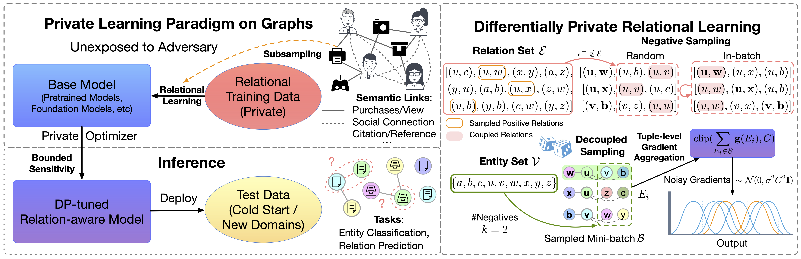

<h1 align="center">PvGaLM: Privately Learning from Graphs with Applications in Fine-tuning Large Language Models</h1>
<p align="center">
    <a href="https://arxiv.org/pdf/2410.08299v1"></a>
    <a href="https://github.com/Graph-COM/PvGaLM"></a>
    <a href="https://github.com/Graph-COM/PvGaLM/blob/main/LICENSE"></a>
    <a href="https://hits.seeyoufarm.com"></a>
</p>

PvGaLM is a novel privacy-preserving pipeline for relational learning. It provides decoupled training relation sampling paired with efficient tuple-level gradient clipping so that large pretrained models can be fine-tuned on graph data through DP-SGD with rigorous privacy guarantee.

We consider two specific use cases for private relational learning:  
**Cross-category recommendation**: When launching new product lines, RecSys models often face the problem of lacking historical data for prediction (e.g., co-purchase), which can be alleviated by leveraging user purchase history of complementary categories, but these co-purchase relations contain sensitive user behaviors.  
**Cross-regional model deployment**: Financial institutions operate in multiple locations, and their service models (e.g., fraud detection) are normally trained on transaction data collected from major markets and then deployed to multiple
regions after fine-tuning, but this practice is often challenged by regional data protection regulations.

<p align="center"></p> 


## Currently Supported Models & Tasks
HuggingFace: [BERT.base](https://huggingface.co/google-bert/bert-base-uncased), [BERT.large](https://huggingface.co/google-bert/bert-large-uncased), [Llama2-7B](https://huggingface.co/meta-llama/Llama-2-7b-hf), [Llama2-13B](https://huggingface.co/meta-llama/Llama-2-13b-hf)  
Tasks: Relation Prediction, Entity Classification

## Environment Configuration
### Requirements
(Other versions may work but are untested)
* python >= 3.11
* pytorch >= 2.1.2
* transformers >= 4.23.0
* peft == 0.10.0
* opacus == 1.4.1

### Install by Conda 
- Update conda:
```bash
conda update -n base -c defaults conda
```
- Install basic dependencies to the virtual environment and activate it: 
```bash
conda env create -f environment_pyvacy.yml
conda activate pyvacy
```

### Install by Pip
```
conda create -n pyvacy python=3.11
pip install torch==2.1.2 torchvision==0.16.2 torchaudio==2.1.2 --index-url https://download.pytorch.org/whl/cu118
pip install transformers==4.39.3
pip install sentencepiece
pip install peft
pip install datasets
pip install evaluate
pip install opacus==1.4.1
pip install wandb
pip install pandas
pip install scikit-learn
```

To use Jupyter Notebook

```
conda install ipykernel
ipython kernel install --user --name=pyvacy
```

### Commands

non-private fine-tuning on relational data

```
bash lp_train_galm.sh $GPU_ID $DATASET $BATCH_SIZE $MODEL
bash lp_train_galm.sh 0 sports 128 large
```

fine-tuning on relational data with DP

```
bash lp_train_pvgalm.sh $GPU_ID $DATASET $EPSILON $NOISE_SCALE $CLIPPING_NORM $BATCH_SIZE 
bash lp_train_pvgalm.sh 0 mag_us -1 0.433 1 64
```

few-shot relation prediction

```
bash lp_train_pvgalm_fewshot.sh $GPU_ID $DATASET $BATCH_SIZE
bash lp_train_pvgalm_fewshot.sh 0 cloth 16
```

few-shot entity classification

```
bash nc_train_galm.sh $GPU_ID $DATASET $BATCH_SIZE
bash nc_train_galm.sh 0 mag_cn 128
```

### Datasets
Please follow the description in Appx. C to obtain the MAG and the AMAZ datasets.

## Citation
Please cite our paper if you are interested in our work.
```
@inproceedings{
    yin2024privately,
    title={Privately Learning from Graphs with Applications in Fine-tuning Large Language Models},
    author={Haoteng Yin and Rongzhe Wei and Eli Chien and Pan Li},
    booktitle={Statistical Foundations of LLMs and Foundation Models (NeurIPS 2024 Workshop)},
    year={2024},
}
```
